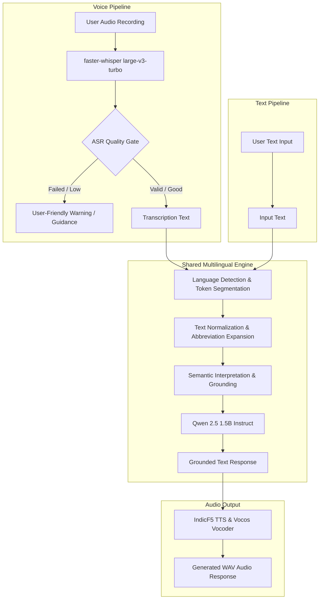

# MultiMix AI

MultiMix AI is a multilingual and code-mixed conversational AI system designed to understand and respond to mixed Indian-language communication across both text and voice modalities.

---

## 1. Project Overview

Natural communication across India rarely occurs in a single language. Speakers routinely interweave regional Indian languages with English within individual phrases and sentences. Traditional conversational systems typically assume single-language input or fail when confronted with colloquial Romanized transliterations.

MultiMix AI bridges this gap with an end-to-end, locally hosted pipeline that detects, segments, normalizes, and semantically interprets code-mixed input, producing grounded conversational responses in both text and synthetic speech.

### Target Languages
- **Telugu** (Romanized & Native Telugu script)
- **Tamil** (Romanized & Native Tamil script)
- **Hindi** (Romanized & Devanagari script)
- **Bengali** (Romanized & Bengali script)
- **English**

### Interaction Modalities
- **Input:** Text or Voice (audio recording upload)
- **Output:** Structured text response and generated voice audio (WAV)

---

## 2. Problem Statement

Code-mixing (switching between languages within a single utterance) is the linguistic norm in modern Indian communication. For example:

> *"Nenu today college ki vellanu, but my friend Tamil-la pesitu irundhan"*

In this sentence:
- **Telugu:** `Nenu` ("I"), `ki vellanu` ("went to")
- **English:** `today`, `college`, `but`, `my`, `friend`
- **Tamil:** `Tamil-la` ("in Tamil"), `pesitu irundhan` ("was speaking")

Conventional ASR and NLP pipelines fail on such inputs because:
1. Language identification models usually make a single, sentence-level prediction.
2. Large Language Models (LLMs) struggle to directly decode non-standard Romanized transliterations of Indian regional languages.
3. Slang and informal abbreviations (`todayy`, `clg`, `plz`, `frnd`) amplify ambiguity.

MultiMix AI solves this by explicitly decomposing the code-mixed input into token-level language segments, normalizing informal abbreviations, reconstructing the underlying semantic meaning, and feeding that grounded interpretation into the LLM.

---

## 3. Core Features

- **Multilingual Language Detection:** Detects constituent languages using a hybrid system combining native Unicode script boundaries, Romanized lexical analysis, and IndicLID fastText embeddings.
- **Token-Level Language Segmentation:** Segments sentences token-by-token and assigns language labels with confidence scores and detection methods.
- **Romanized & Native-Script Processing:** Full support for both Latin-script transliterations and native Indic scripts (Devanagari, Telugu, Tamil, Bengali).
- **Contextual Ambiguity Resolution:** Resolves short, ambiguous particles (`ki`, `lo`, `la`, `me`, `to`) using neighboring token context rather than isolated heuristics.
- **Text Normalization:** Expands informal SMS/chat abbreviations (`tmrw`, `clg`, `frnd`, `plz`, `bcoz`) while preserving legitimate multilingual words.
- **Semantic Interpretation:** Rule-grounded semantic translator converts code-mixed input into unified semantic representations before LLM ingestion.
- **Local Qwen Response Generation:** Offline conversational AI using `Qwen2.5-1.5B-Instruct` running on local CPU (zero external API dependencies).
- **Voice Transcription with Faster-Whisper:** Fast speech recognition powered by `faster-whisper large-v3-turbo` with INT8 quantization.
- **ASR Quality Validation Gate:** Pre-LLM quality validation analyzing `avg_logprob`, `no_speech_prob`, and `compression_ratio` to intercept low-quality or failed transcriptions.
- **IndicF5 Text-to-Speech:** Local neural speech synthesis using IndicF5 (DiT architecture) coupled with a Vocos 24kHz neural vocoder.
- **Interactive Streamlit Web UI:** Two-tab interface supporting text chat and voice upload with collapsible developer diagnostics.
- **Graceful Failure Handling:** User-friendly warnings and recovery recommendations when audio is uninterpretable, ensuring no unhandled tracebacks reach the UI.

---

## 4. Architecture

MultiMix AI shares a unified downstream NLP and response architecture across both its text and voice pipelines.



---

## 5. Technology Stack

- **Core Runtime:** Python 3.12+
- **Deep Learning Framework:** PyTorch (`torch`, `torchaudio`)
- **Large Language Model:** Hugging Face `transformers`, `Qwen/Qwen2.5-1.5B-Instruct`
- **Speech-to-Text (ASR):** `faster-whisper` (backed by `ctranslate2`)
- **Language Identification:** `fasttext-wheel`, AI4Bharat IndicLID components
- **Text-to-Speech (TTS):** `f5-tts` (IndicF5 Diffusion Transformer DiT)
- **Neural Vocoder:** `vocos` (charactr/vocos-mel-24khz)
- **Audio Processing:** `soundfile`, `librosa`, `pydub`
- **User Interface:** `streamlit`

---

## 6. Model Information

All models run entirely locally. No external cloud endpoints or API keys are required.

| Model / Component | Purpose | Local Path | Runtime Environment | Pipeline Status |
| :--- | :--- | :--- | :--- | :--- |
| **Qwen 2.5 1.5B Instruct** | Conversational response generation | `models/qwen2.5-1.5b-instruct` | PyTorch / Float32 (CPU) | **Active** (Primary LLM) |
| **faster-whisper large-v3-turbo** | Voice transcription (ASR) | `models/whisper-turbo` | CTranslate2 / INT8 (CPU) | **Active** (Primary ASR) |
| **IndicF5 (DiT)** | Neural speech synthesis (TTS) | `models/indicf5` | PyTorch / Float32 (CPU) | **Active** (Primary TTS) |
| **Vocos** | Neural vocoder for IndicF5 | Hugging Face cache (`charactr/vocos-mel-24khz`) | PyTorch / Float32 (CPU) | **Active** (Vocoder) |
| **IndicLID** | Romanized language identification | `models/indic_lid/model_baseline_roman.bin` | fastText | **Active** (Supporting LID) |
| **mT5 Small** | Multilingual supporting model | `models/mt5-small` | Hugging Face `transformers` | *Downloaded* (Reserved for translation research; not in primary response path) |

---

## 7. Project Structure

```
MultiMix-AI/
├── app.py                      # Main Streamlit web application
├── requirements.txt            # Python dependencies
├── .gitignore                  # Git exclusion rules
├── README.md                   # Primary project overview
├── CHANGELOG.md                # Project milestone changelog
├── assets/
│   └── audio/                  # Reference & demo audio files
│       ├── WhatsApp Audio...   # Real WhatsApp code-mixed audio clips
│       └── generated/          # Output WAV files from TTS
├── docs/                       # Technical & handover documentation
│   ├── ARCHITECTURE.md         # Detailed subsystem architecture
│   ├── INSTALLATION.md         # Environment & model setup instructions
│   ├── TESTING.md              # Test suite documentation & coverage
│   ├── DEPLOYMENT.md           # Local & future production deployment guide
│   ├── CLIENT_HANDOVER.md      # Client handover & operational manual
│   └── TASK6_TEST_REPORT.md    # Full Task 6 regression test report
├── models/                     # Local model weights directory (not committed)
│   ├── indicf5/                # IndicF5 checkpoints and prompts
│   ├── indic_lid/              # IndicLID fastText binary
│   ├── mt5-small/              # mT5 small checkpoint
│   ├── qwen2.5-1.5b-instruct/  # Qwen 2.5 1.5B model weights
│   ├── whisper/                # Legacy whisper model (retained)
│   └── whisper-turbo/          # faster-whisper large-v3-turbo weights
├── src/                        # Core backend modules
│   ├── config.py               # Portable path resolution & configuration
│   ├── language/               # Language detection & segmentation
│   │   ├── detector.py         # Script & lexical code-mix detector
│   │   └── segmenter.py        # Token-level language segmenter
│   ├── normalization/          # Text preprocessing & normalization
│   │   └── corrector.py        # Abbreviation expander & token normalizer
│   ├── response/               # Response generation modules
│   │   ├── generator.py        # Local Qwen prompt builder & generator
│   │   └── voice_response.py   # Integrated voice-response coordinator
│   ├── semantic/               # Semantic grounding & interpretation
│   │   └── interpreter.py      # Rule-based semantic reconstructor
│   └── voice/                  # Voice processing modules
│       ├── pipeline.py         # Complete voice pipeline with quality gate
│       ├── tts_engine.py       # IndicF5 + Vocos synthesis engine
│       └── whisper_engine.py   # faster-whisper transcription & quality scoring
└── tests/                      # Automated test suites
    ├── test_faster_whisper.py   # ASR diagnostic tool
    ├── test_task2_regression.py # Task 2 faster-whisper regression suite
    ├── test_task3_regression.py # Task 3 ASR quality gate regression suite
    └── test_task6_regression.py # Comprehensive Task 6 regression suite
```

---

## 8. Installation

### Prerequisites
- Python 3.12 (64-bit recommended)
- Git
- 16 GB+ System RAM recommended for local CPU execution
- Virtual environment tool (`venv`)

### Setup Instructions

1. **Clone the repository:**
   ```bash
   git clone <repository-url>
   cd MultiMix-AI
   ```

2. **Create and activate a virtual environment:**
   ```powershell
   # Windows PowerShell
   python -m venv .venv
   .\.venv\Scripts\Activate.ps1
   ```

3. **Install dependencies:**
   ```bash
   pip install --upgrade pip
   pip install -r requirements.txt
   ```

4. **Verify local models:**
   Ensure the local model directories exist under `models/` as detailed in [Section 6](#6-model-information). Detailed model acquisition steps are provided in [`docs/INSTALLATION.md`](docs/INSTALLATION.md).

---

## 9. Running the Application

Launch the Streamlit web interface using:

```bash
streamlit run app.py
```

The application will start and provide a local URL (typically `http://localhost:8501`).

*Note: If developing in environments where file modifications trigger excessive reloads, you can optionally run with:*
```bash
streamlit run app.py --server.fileWatcherType none
```

---

## 10. Text Usage

1. Open the application and select the **💬 Text Interaction** tab.
2. Enter a multilingual sentence into the text box. Example:
   ```
   Nenu today college ki vellanu, but my friend Tamil-la pesitu irundhan
   ```
3. Click **Submit**.
4. The system executes:
   - **Language Detection:** Identifies `Telugu`, `English`, and `Tamil`.
   - **Token Segmentation:** Segments words with associated language confidence.
   - **Semantic Interpretation:** Grounded to `"I went to college today but my friend was speaking in Tamil"`.
   - **Qwen Generation:** Generates a conversational response (e.g., acknowledging the multi-lingual interaction).
   - **Voice Synthesis:** Optionally generates a companion WAV audio response using IndicF5.

---

## 11. Voice Usage

1. Select the **🎤 Voice Interaction** tab.
2. Upload an audio recording. Supported formats:
   - `.wav`, `.mp3`, `.mp4`, `.m4a`, `.ogg`, `.flac`
3. Click **Process Voice**.
4. The system executes:
   - **faster-whisper large-v3-turbo:** Transcribes speech and calculates ASR metrics (`avg_logprob`, `no_speech_prob`, `compression_ratio`).
   - **ASR Quality Validation Gate:** Verifies transcription confidence. If audio is unintelligible, clear guidance is returned.
   - **Multilingual Pipeline:** Passes valid transcription through language segmentation, normalization, and semantic grounding.
   - **Qwen Generation:** Generates an AI text response.
   - **IndicF5 Voice Synthesis:** Synthesizes and embeds a spoken WAV reply.

---

## 12. Testing

MultiMix AI includes automated test suites covering all subsystems.

### Task 6 Comprehensive Verification Summary
- **Task 6 Comprehensive Suite (`test_task6_regression.py`):** 91/91 passed
- **Task 3 ASR Quality Gate Suite (`test_task3_regression.py`):** 29/29 passed
- **Streamlit Compilation & Startup Integrity:** 2/2 passed
- **Total Tests Passed:** **122 / 122 (100% pass rate, 0 failures)**

```bash
# Execute the full Task 6 regression suite
python tests/test_task6_regression.py

# Execute the ASR quality validation regression suite
python tests/test_task3_regression.py
```

*Note: These tests validate software regression, module integration, failure handling, and pipeline contracts; they do not represent statistical multilingual ASR accuracy on unseen public benchmarks.*

Detailed results and logs are recorded in [`docs/TASK6_TEST_REPORT.md`](docs/TASK6_TEST_REPORT.md).

---

## 13. Known Limitations

1. **CPU Latency:**
   - Speech recognition using `faster-whisper large-v3-turbo` requires ~50–100 seconds per audio clip on CPU.
   - `IndicF5` neural speech synthesis requires ~2–3 minutes per sentence on CPU.
   - Real-time conversational latency requires a CUDA-compatible GPU.
2. **ASR Script Representation:**
   - Faster-Whisper transcribes multilingual Indian audio using phonetic Devanagari or regional Indic characters (e.g. `नेनु तुडे कालेज...`) rather than preserving Romanized Latin spelling. The downstream pipeline handles this, but raw transcripts reflect phonetic script assignment.
3. **Manual Verification Required:**
   - End-user audio output through physical speakers and live client microphone recording in the browser must be manually verified on target machines.
4. **Local Model Footprint:**
   - Model weights exceed several gigabytes and cannot be stored directly in Git repositories.

---

## 14. Security & Secrets Management

- **Zero Cloud API Keys:** The entire core pipeline runs strictly locally. No external OpenAI, Anthropic, or cloud API keys are required.
- **Environment Isolation:** Do not commit local `.env` files, credentials, or internal tokens.
- **Binary Exclusion:** Large model weights (`*.bin`, `*.safetensors`, `*.pt`) must remain in local `models/` directories excluded via `.gitignore`.
- **Generated Data:** Audio generated during interactive testing should not be committed to source control.

---

## 15. GitHub Preparation Guidelines

When preparing this repository for publication or handover:

### Items to Commit
- Application source code (`app.py`, `src/`)
- Automated test suites (`tests/`)
- Project documentation (`README.md`, `CHANGELOG.md`, `docs/`)
- Dependency specifications (`requirements.txt`, `.gitignore`)
- Standard audio demo assets (`assets/audio/WhatsApp...`)

### Items to Exclude (`.gitignore`)
- Virtual environments (`.venv/`, `tts_venv/`)
- Model checkpoints and cache directories (`models/`, `hf_cache/`, `torch_cache/`)
- Temporary audio generation outputs (`assets/audio/generated/*.wav`, `assets/audio/uploads/*`)
- Environment configurations containing local paths or secrets (`.env`)
