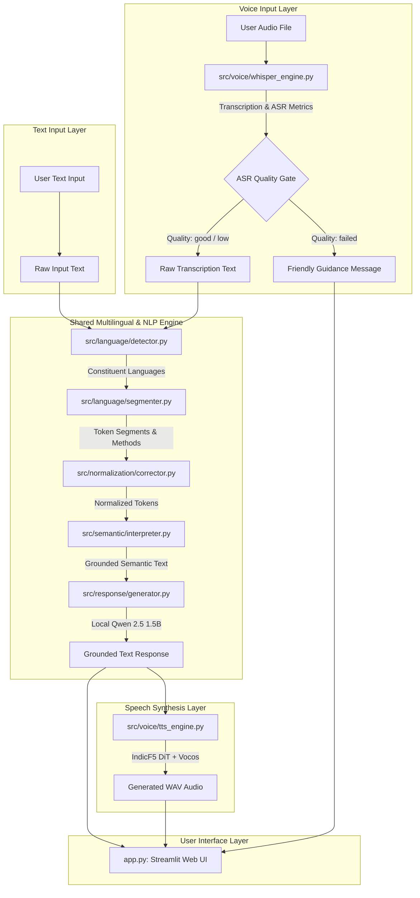

# MultiMix AI — System Architecture & Technical Specifications

This document provides a detailed technical breakdown of the MultiMix AI system architecture, subsystem contracts, and end-to-end data flow.

---

## 1. System Overview & Unified Data Flow

MultiMix AI processes multilingual and code-mixed inputs across two primary modalities: **Text Interaction** and **Voice Interaction**. Both pipelines converge onto a shared downstream multilingual processing engine.



---

## 2. Subsystem Breakdown

### 2.1. Input Layer
- **Components:** `app.py` (Streamlit interface), `src/config.py` (runtime upload directories)
- **Role:** Handles incoming user interactions via standard web forms:
  - *Text Input:* Accepts free-form Romanized or native script strings.
  - *Voice Input:* Accepts uploaded audio files (`.wav`, `.mp3`, `.mp4`, `.m4a`, `.ogg`, `.flac`), caching uploads to `assets/audio/uploads/`.

### 2.2. Voice Transcription (ASR Engine)
- **Component File:** `src/voice/whisper_engine.py`
- **Model:** `faster-whisper large-v3-turbo` with INT8 quantization on CPU.
- **Workflow:**
  1. Audio file is processed via `WhisperModel.transcribe()` with VAD (Voice Activity Detection) filter enabled and beam size 5.
  2. Extracts segment-level time intervals, segment text, and key diagnostic metrics:
     - `avg_logprob`: Average log-probability across speech tokens (confidence measure).
     - `no_speech_prob`: Probability that audio contains silence or background noise.
     - `compression_ratio`: Token repetition and compression metric.
  3. Returns a structured dictionary containing `text`, `language`, `language_probability`, `segments`, and quality metrics.

### 2.3. ASR Quality Validation Gate
- **Component File:** `src/voice/whisper_engine.py` (`validate_asr_quality()`) & `src/voice/pipeline.py`
- **Thresholds & Rules:**
  - *Failure Condition:* Empty transcription, `avg_logprob < -1.5`, or `no_speech_prob > 0.8`.
  - *Low Confidence Condition:* `-1.5 <= avg_logprob < -0.7`, `0.3 < no_speech_prob <= 0.8`, or `compression_ratio > 2.4`.
  - *Good Condition:* All metrics within high-confidence margins.
- **Circuit Breaker Behavior:**
  - If tagged as `failed`, processing halts immediately. An empty result is returned with the friendly message:
    > *"Sorry, I couldn't reliably understand the audio. Please try recording again with clearer speech."*
  - The failed transcript is preserved in developer diagnostic metadata for debugging, but no call is dispatched to Qwen or IndicF5.

### 2.4. Language Detection
- **Component File:** `src/language/detector.py` (`analyze_code_mix()`)
- **Supporting Model:** IndicLID fastText binary (`model_baseline_roman.bin`)
- **Strategy:**
  1. *Native Script Layer:* Scans for Unicode script blocks (Telugu: `\u0C00-\u0C7F`, Tamil: `\u0B80-\u0BFF`, Bengali: `\u0980-\u09FF`, Devanagari: `\u0900-\u097F`).
  2. *Romanized Lexical Layer:* Matches tokens against curated lexicons for Telugu, Tamil, Hindi, Bengali, and English, applying differential weights based on token character length.
  3. *IndicLID Supporting Layer:* Evaluates fastText predictions at high confidence (>0.85) without contradicting native script evidence.
  4. *Ambiguity Filter:* Skips isolated ambiguous tokens (`ki`, `la`, `lo`, `me`, `ka`) during sentence-level language determination.

### 2.5. Token-Level Language Segmentation
- **Component File:** `src/language/segmenter.py` (`get_language_segments()`)
- **Role:** Annotates individual tokens in the sentence:
  - Detects explicit language markers (e.g., `Tamil-la` → Tamil, `Telugu-lo` → Telugu).
  - Classifies common English and Indic vocabulary.
  - Applies *contextual ambiguity resolution*: short ambiguous particles inherit the language of surrounding tokens (e.g. `college ki vellanu` → `ki` is resolved to Telugu).
- **Output:** A list of segment objects with `token`, `language`, `method`, and `confidence`.

### 2.6. Text Normalization
- **Component File:** `src/normalization/corrector.py` (`normalize_text()`, `normalize_token()`)
- **Role:** Cleans and normalizes informal conversational input:
  - Expands informal SMS/chat abbreviations: `tmrw` → `tomorrow`, `tomo` → `tomorrow`, `todayy` → `today`, `frnd` → `friend`, `clg` → `college`, `plz` → `please`, `bcoz` → `because`.
  - Collapses redundant elongated characters (`todayyy` → `today`).
  - Preserves multilingual tokens (`nenu`, `vellanu`, `pesitu`, `Tamil-la`) without false English autocorrection.

### 2.7. Semantic Interpretation
- **Component File:** `src/semantic/interpreter.py` (`interpret_code_mix()`)
- **Role:** Reconstructs the semantic meaning of the code-mixed input into a coherent English representation:
  - Maps Romanized Indic verbs, nouns, and postpositions (`nenu` → `I`, `vellanu` → `went`, `ki` → `to`).
  - Reconstructs common syntactical structures (e.g., Subject-Object-Verb to Subject-Verb-Object).
  - Converts language markers into natural clauses (`Tamil-la` → `in Tamil`).
  - Formulates a grounded English sentence (e.g., `"I went to college today but my friend was speaking in Tamil"`).

### 2.8. Response Generation (Local Qwen LLM)
- **Component File:** `src/response/generator.py` (`generate_response()`)
- **Model:** `Qwen2.5-1.5B-Instruct`
- **Execution:** Offline local inference on CPU using Float32 weights.
- **Prompt Grounding:**
  - Instructs Qwen with system guidance to respond helpfully, naturally, and concisely.
  - Feeds the reconstructed semantic interpretation as the primary grounding context, freeing Qwen from having to decipher ambiguous Romanized transliterations independently.

### 2.9. Speech Synthesis (IndicF5 TTS & Vocos Vocoder)
- **Component File:** `src/voice/tts_engine.py` (`synthesize_speech()`)
- **Model Architecture:** IndicF5 Diffusion Transformer (`DiT`) + `Vocos` neural vocoder (24kHz).
- **Execution:**
  - Loads checkpoint from `models/indicf5/model.safetensors` and vocabulary from `checkpoints/vocab.txt`.
  - Uses reference audio prompt (`PAN_F_HAPPY_00001.wav`) for voice style conditioning.
  - Generates speech waveforms saved as 24,000 Hz WAV audio files under `assets/audio/generated/`.

### 2.10. Configuration & Dynamic Paths
- **Component File:** `src/config.py`
- **Role:** Dynamically calculates project roots and directory structures:
  - Determines `PROJECT_ROOT` based on config file location or `MULTIMIX_PROJECT_ROOT` environment override.
  - Exposes paths: `MODELS_DIR`, `ASSETS_DIR`, `AUDIO_DIR`, `GENERATED_AUDIO_DIR`, `UPLOADS_AUDIO_DIR`, `QWEN_MODEL_PATH`, `INDICF5_MODEL_DIR`, `WHISPER_TURBO_MODEL_DIR`, `INDICLID_MODEL_PATH`, `MT5_MODEL_DIR`.
  - Automatically ensures runtime audio output directories exist.

### 2.11. Streamlit User Interface
- **Component File:** `app.py`
- **Role:** Provides a responsive, accessible two-tab web interface:
  - **Tab 1: Text Interaction:** Text input area, submission button, structured output sections (Semantic Interpretation, Detected Languages, AI Response, Audio Player), and collapsed developer inspection details.
  - **Tab 2: Voice Interaction:** File uploader, audio player for uploaded file, process button, quality status indicator, transcription display, response display, and synthetic voice player.

---

## 3. Data Flow Specifications

### Text Interaction Data Flow
```
User String
  → analyze_code_mix()        [Language candidate set]
  → get_language_segments()   [Token segments with confidence]
  → normalize_text()          [Normalized text string]
  → interpret_code_mix()      [Semantic interpretation string]
  → generate_response()       [Qwen grounded text answer]
  → synthesize_speech()       [IndicF5 24kHz WAV file]
  → Streamlit UI Presentation [Display text + Audio player]
```

### Voice Interaction Data Flow
```
User Audio File (.wav/.mp3/.mp4)
  → transcribe_audio()        [Text + segments + avg_logprob + no_speech_prob]
  → validate_asr_quality()    [Status: good / low / failed]
  IF failed:
      → Early Return: Show user warning, display debug info, skip LLM & TTS
  IF good or low:
      → get_language_segments()
      → normalize_text()
      → interpret_code_mix()
      → generate_response()
      → synthesize_speech()
      → Streamlit UI Presentation
```
